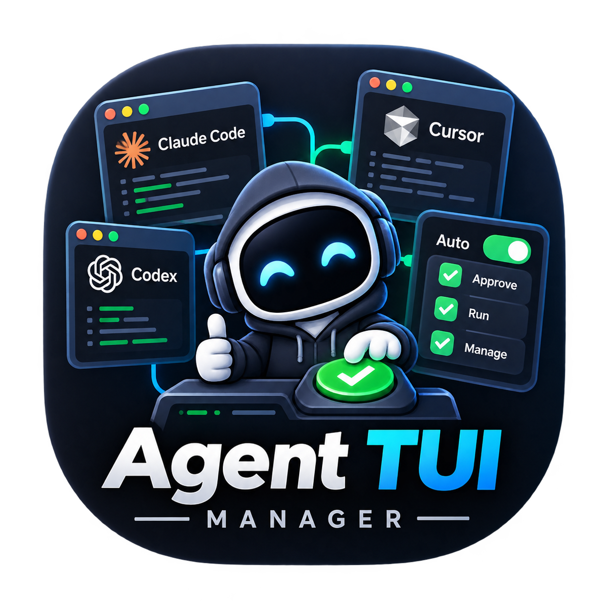
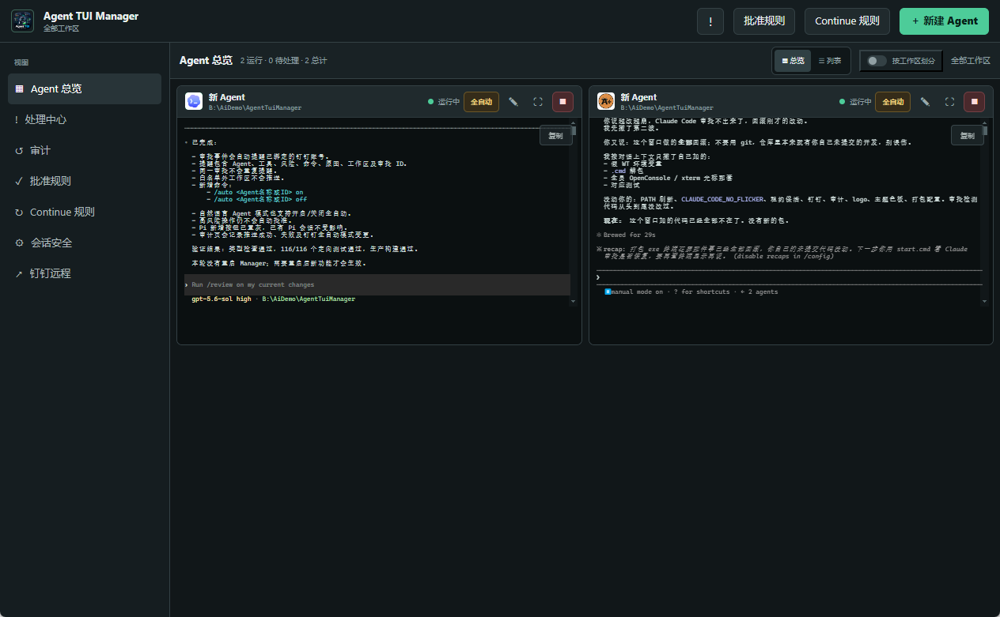
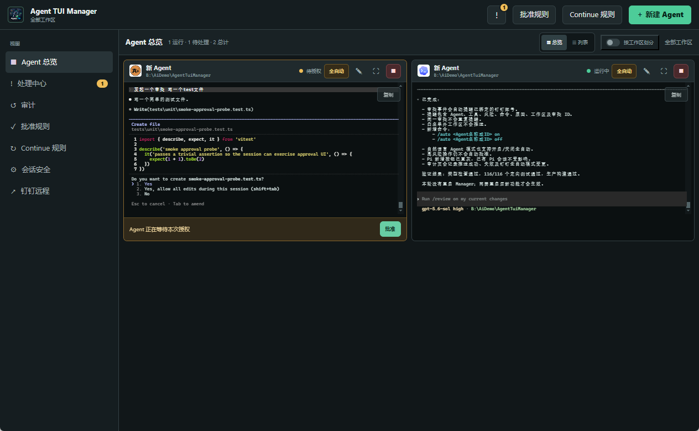
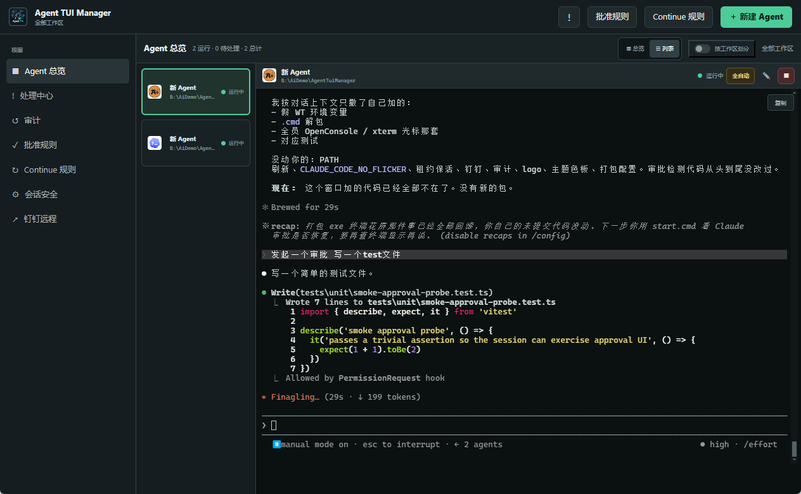
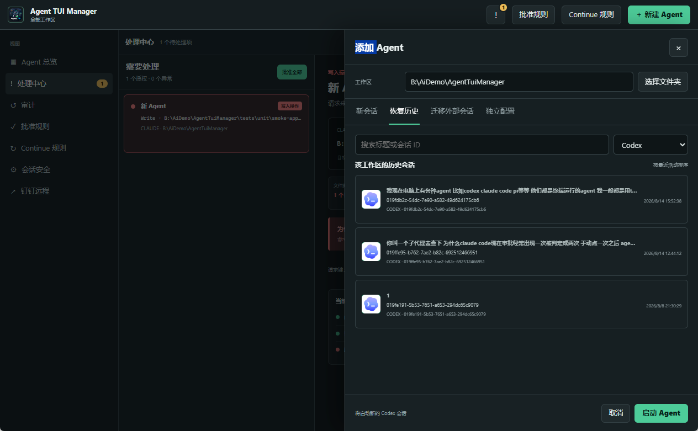
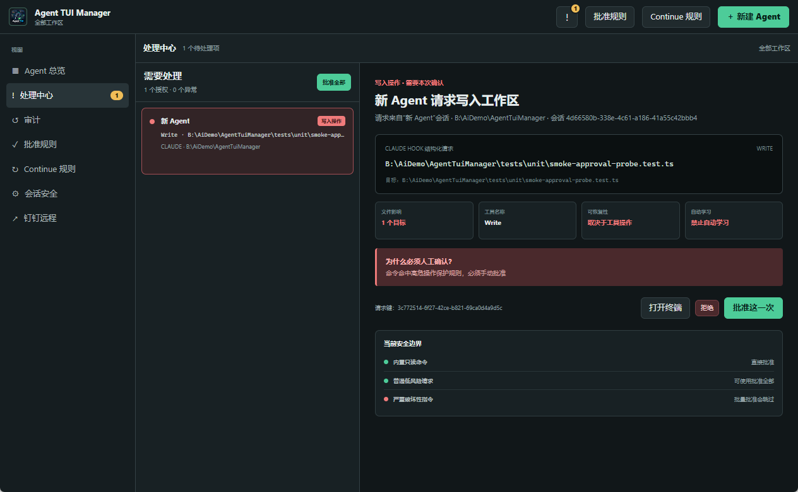
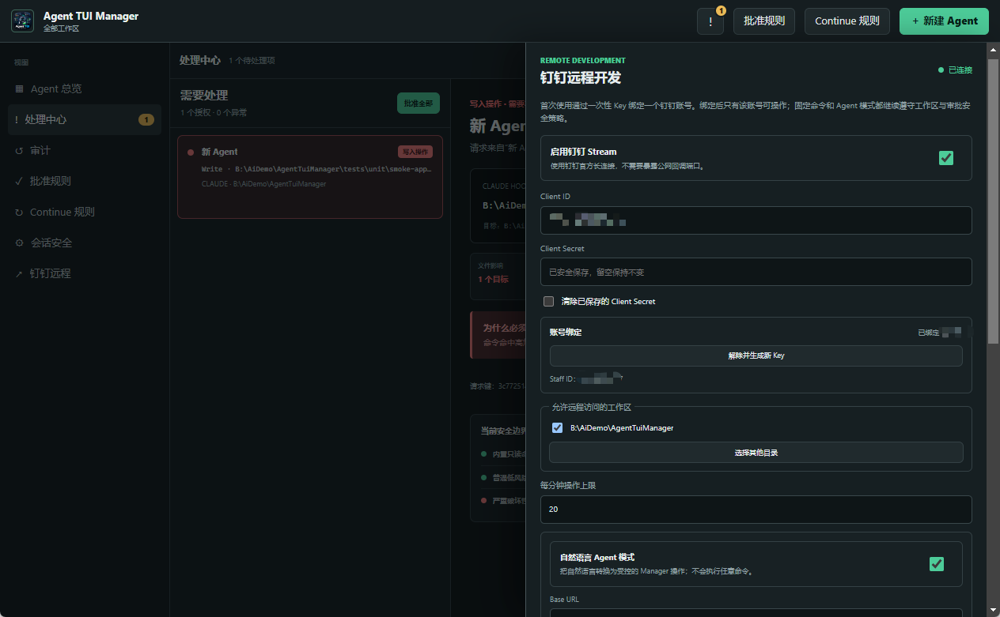
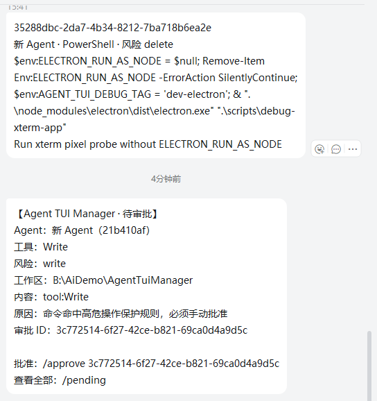

# Agent TUI Manager

<p align="center">
  
</p>

<p align="center">
  <strong>跨平台多 Agent 终端工作台</strong><br />
  并排跑 Claude Code / Codex / Pi，统一审批、恢复与远程值班<br />
  <em>不抢走会话，不改写原生工作流</em>
</p>

<p align="center">
  <a href="#快速开始">快速开始</a> ·
  <a href="#核心能力">能力</a> ·
  <a href="#审批与安全">安全</a> ·
  <a href="#钉钉远程控制">钉钉</a> ·
  <a href="LICENSE">MIT License</a>
</p>

---

**Agent TUI Manager** 把多个终端型 Agent 放进同一扇桌面窗口：选工作区、恢复原生历史会话、处理工具授权、查看审计，并在需要时用钉钉远程点一下批准。  
终端画面来自真实 PTY + xterm，不是用聊天气泡重绘 Agent。

> Manager 永远不是会话的所有者。删掉本应用后，你仍可用 `claude --resume` / `codex resume` 回到官方历史。

---

## 截图

### 终端墙总览



### 卡片内审批



### 详情全屏



### 新建 / 恢复原生会话



### 处理中心 / 审计



### 钉钉远程设置



### 钉钉消息侧



更多截图约定见 [`media/README.md`](media/README.md)。

---

## 它解决什么问题

| 痛点 | Manager 怎么做 |
|---|---|
| 多开终端，状态靠 Alt+Tab | 总览墙 / 列表模式一眼扫完 |
| 低风险命令反复点批准 | 规则学习 + 全自动（有高危黑名单） |
| 崩了不敢乱 Continue | 正常完成 / 用户停止 / 异常退出严格区分 |
| UI 关了长任务也没了 | Session Host 可与窗口解耦，支持保留工作区 |
| 人不在电脑前 | 可选钉钉 Stream：审批、发送、停启、审计 |

更完整的产品叙述见 [`docs/open-source-intro.md`](docs/open-source-intro.md)（若你本地忽略了 `docs/`，以本 README 为准即可）。

---

## 核心能力

- **多 Agent 总览**：网格墙或列表模式同时管理多个终端 Agent  
- **工作区与原生历史**：按本地目录选 workspace；恢复 Codex / Claude Code 原生会话  
- **会话过滤**：过滤不可交互的 Codex subagent 线程，只展示可恢复的顶层会话  
- **审批中心**：统一查看、批准、拒绝；安全规则与全自动模式  
- **审计**：启动、停止、审批、规则命中、异常、远程操作可回看  
- **独立配置**：可为单个 Agent 配 Base URL、API Key、模型、启动参数和 HTTP 代理，**不覆盖**本机全局配置  
- **环境检测**：检测 Node.js / npm / Agent CLI；可在新建面板安装或自选可执行文件  
- **生命周期**：Manager 重启后可重新接管保留的 Agent；停止/删除时释放原生会话 writer  
- **钉钉远程**：Stream 机器人查看 Agent、处理审批、发送任务；可选受限自然语言模式  
- **拖出终端**：受管 Agent 可拖出为普通终端；外部拖入仍为 Beta 且默认关闭  

---

## 运行要求

- Windows 10 / 11 x64，或 macOS 12+（Intel / Apple Silicon）
- Node.js 20+ 与 npm（开发或从源码运行时）  
- 至少一个受支持的 Agent CLI：`Codex`、`Claude Code` 或 `Pi`  
- macOS 使用一键安装 Node.js / ripgrep 时需要 Homebrew；已自行安装则不需要

CLI 未进 `PATH` 时，可在新建 Agent 的高级设置里选择完整可执行文件；Windows 支持 `.exe` / `.cmd` / `.bat` / `.com`，macOS 支持 POSIX 可执行文件。

---

## 快速开始

### 安装包（推荐分发）

使用 Release 中的 NSIS 安装包，例如：

```text
Agent-TUI-Manager-Setup-0.1.0-x64.exe
```

安装后启动应用，再准备好本机 Agent CLI 即可。

### 开发模式

双击仓库根目录 [`start.cmd`](start.cmd)。首次运行会安装依赖并打开开发版。

或在 PowerShell 中：

```powershell
npm install
npm run dev
```

> `start.cmd` 在依赖未安装时默认走本机 `127.0.0.1:7897` HTTP 代理下载。若没有该代理，请直接 `npm install`，或按自己的网络配置 npm。

macOS 从源码运行：

```bash
npm install
npm run dev
```

从 Finder 启动时，Manager 会读取登录 Shell 的 `PATH`，兼容 Homebrew 的 `/opt/homebrew/bin` 和 `/usr/local/bin`。

---

## 基本使用

1. 点击 **新增 Agent**  
2. 选择 Codex、Claude Code 或 Pi  
3. 用目录选择器指定本地工作区  
4. **新建会话**，或从该工作区的**原生历史**里选一个继续  
5. 环境检测通过后启动  
6. 在总览墙、列表模式、处理中心之间切换，处理输入与审批  

- **停止**：关掉终端进程并释放会话，Manager 卡片保留，可再启动  
- **删除**：只移除 Manager 记录，**不会**删除 Codex / Claude Code / Pi 的原生历史  

---

## 独立配置

默认继承本机各 Agent 的已有配置。只有显式打开「独立配置」后，Manager 才会为该实例注入单独的服务地址、密钥和模型。

- 不覆盖本机默认配置  
- API Key、代理密码、钉钉 Client Secret **不写**进审计正文  
- 停止或删除时清理临时配置，并恢复原生会话可用性  
- 支持从 CC Switch 读 Provider，或手动填 OpenAI-compatible 配置  

---

## 审批与安全

- 普通只读命令可手动加入自动批准规则  
- 重复批准的低风险工具会提示加入学习列表  
- **删除、严重权限变更、下载后执行等其它高危操作不会自动学习**  
- 全自动模式仍会拦截删除类与严重危险命令，并写审计  
- 异常恢复**不会**自动发送 `continue`；无响应时先问你是否重启  

全自动会放宽大量人工确认，只建议在清楚当前任务与工作区内容时**临时**打开。

---

## 钉钉远程控制

在设置里填入钉钉 Stream 应用凭据后，Manager 会生成一次性绑定 Key。在钉钉发送：

```text
/init <key>
```

绑定后用 `/help` 查看命令（列表、待审批、指定/全部批准、发送、停止、重启、审计等）。

- 仅已绑定账号可操作  
- Agent 操作仍受**工作区白名单**与**本地风险规则**约束  
- 远程批准不能绕过本地高危拦截  

---

## 构建 Windows 安装包

```powershell
npm run dist:win
```

默认产物在 `release/`（NSIS x64）。本地若 `release\win-unpacked` 被旧进程占用，可先退出全部 Manager 再打包。


## 构建 macOS 安装包

在 macOS 机器上安装依赖后执行：

```bash
npm run dist:mac
```

默认生成 DMG 和 ZIP。由于 `node-pty` 包含原生模块，macOS 包必须在对应架构的 Mac 上安装依赖并构建；不支持直接复用 Windows 的 `node_modules` 交叉打包。当前配置未包含 Apple Developer 签名和公证，正式对外分发前仍需配置证书与 notarization。

---

## 开发验证

```powershell
npm run typecheck
npm test
npm run build
```

---

## 数据与兼容性

Manager 只管理进程与交互状态，**不替代**原生会话存储。应用不可用时，仍可在对应工作区用原生命令恢复，例如：

```powershell
codex resume <session-id>
claude --resume <session-id>
```

为避免 active writer 冲突：请先在 Manager 里**停止或删除**仍占用该会话的 Agent，再从外部终端 resume。

### 产品不变量（贡献时请遵守）

1. 不把 Agent 会话转成 Manager 私有格式  
2. 终端正文以原始 PTY 为唯一显示源  
3. 高风险操作不可被自动学习或远程一键放行  
4. 正常完成 / 用户停止 / 异常退出必须可区分  

---

## 当前限制

- Windows 已完成真实运行验证；macOS 第一阶段兼容代码已接入，仍需在真实 Intel / Apple Silicon 设备上验收 PTY、审批 Hook、会话保留和打包产物
- 外部终端**拖入**仍为 Beta，默认关闭；**拖出**可用  
- 代理目前支持 **HTTP**；HTTPS / SOCKS5 配置尚未开放  

---

## 技术栈

Electron · React · TypeScript · xterm.js · node-pty（Windows ConPTY / macOS PTY）· 本地 Session Host IPC · Electron safeStorage · 钉钉 Stream SDK

---

## 贡献

欢迎 Issue / PR：适配器与版本兼容、终端保真与测试、文档与安装体验、真实多 Agent 负载下的性能反馈。  
安全相关改动请附复现步骤与影响说明。

---

## License

[MIT](LICENSE) © Agent TUI Manager contributors
